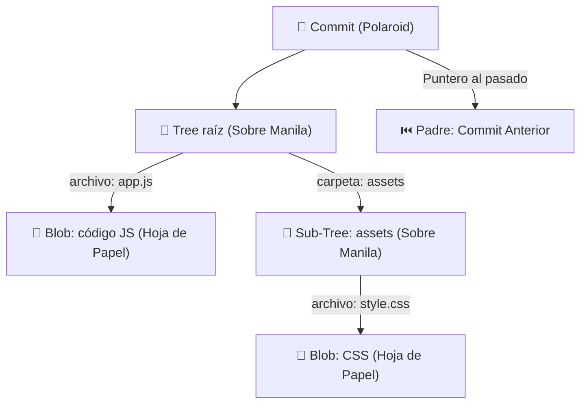

# Módulo 01: Arquitectura Profunda de Git

¡Hola! Bienvenido. Si estás aquí, probablemente ya uses `git commit` y `git push` a diario. Pero, ¿alguna vez te has preguntado qué pasa realmente "debajo del capó" de Git? 

Para un ingeniero de software, Git no es solo una herramienta para subir código. **Git es una Base de Datos de Objetos direccionable por contenido**. Vamos a explicarlo de forma muy humana y práctica para que nunca lo olvides.

---

## 🔬 La analogía del mundo real: El Archivador de Oficina

Imagínate una oficina física clásica con un gran **Archivador de metal**. En el mundo real, Git organiza sus datos exactamente igual que un archivador de oficina inteligente:

1.  **Blobs (Las Hojas de Papel):**
    *   **En la vida real:** Es una hoja de papel escrita a máquina con el contenido de un reporte. No tiene título, no tiene fecha de creación, ni firma. Solo contiene las palabras escritas.
    *   **En Git:** Es un *Binary Large Object*. Guarda el **contenido puro** de un archivo. Git no guarda el nombre del archivo ni sus permisos dentro del Blob; solo los datos. Si dos archivos diferentes tienen el mismo contenido exacto, Git guarda un único Blob. ¡Eficiencia pura!

2.  **Trees (Los Sobres Rotulados):**
    *   **En la vida real:** Es un sobre manila que contiene hojas de papel (Blobs) y otros sobres más pequeños (Sub-Trees). Fuera del sobre escribes: *"Este papel se llama app.js"* y *"Este sobre se llama carpeta assets"*.
    *   **En Git:** El *Tree* representa el **directorio**. Mapea nombres de archivos y permisos a sus respectivos hashes de Blobs o de otros Trees.

3.  **Commits (La Polaroid del Archivador):**
    *   **En la vida real:** Es una fotografía polaroid que le tomas al archivador entero en un momento preciso. En la foto pegas un post-it que dice: *"Autor: Juan, Fecha: Hoy, Mensaje: Ajusté el login. Y por cierto, la foto anterior es la Polaroid #4c5b3d2"*.
    *   **En Git:** Es un objeto que apunta a un Tree raíz (el estado de tu proyecto) y guarda metadatos críticos: autor, fecha, mensaje y el hash del commit padre (para saber de dónde venimos).

### Visualización del Archivador (Grafo Acíclico Dirigido - DAG)

Mira cómo se conectan los objetos internamente en la base de datos de Git:



---

## ⚙️ Integridad y Seguridad: El Hash SHA-1 / SHA-256

En Git, la seguridad no es negociable. Todo lo que guardas en el archivador se identifica por un código de barras único: el **Hash**.

*   **Identidad Única:** Git calcula una huella digital criptográfica (SHA) de 40 caracteres basándose en el contenido de cada objeto. Si cambias una sola letra de un archivo, su Hash cambia por completo. Nadie puede alterar la historia del archivador sin que te des cuenta.
*   **Firma de Commits (Firma GPG):** En entornos profesionales, para evitar que alguien se haga pasar por ti, configuramos firmas digitales para cada Polaroid (Commit):
    ```bash
    # Configura tu clave de firma personal
    git config --global user.signingkey <ID_DE_TU_CLAVE>
    git config --global commit.gpgsign true
    ```

---

## 🧠 Pon a prueba tus conocimientos

<div class="module-quiz-card" data-module="Curso/01-Intro/README.md"></div>

---

## 📝 Resumen Estructurado (Estilo Cornell)

*   **Snapshots, no Diffs:** A diferencia de otros sistemas que guardan "las diferencias" línea por línea, Git guarda fotos completas (**Snapshots**). Si un archivo no cambia, la nueva foto simplemente apunta al sobre anterior. ¡Por eso Git es ridículamente rápido!
*   **Integridad Criptográfica:** El uso de hashes garantiza que tu código no sufra corrupción silenciosa ni alteraciones externas.
*   **Descentralización:** Cada clon es una base de datos completa con todas las Polaroids de la historia del proyecto.

---

## 💻 Laboratorio Práctico: ¡Pruébalo en la terminal virtual!

Abre la terminal virtual (botón flotante abajo a la derecha) e interactúa directamente con la base de datos de Git siguiendo estos pasos en orden para ver cómo trabaja internamente:

1. **Inicializa tu base de datos de Git vacía:**
   ```bash
   git init
   ```
   *(Observa que Git inicializa el repositorio virtual desde cero).*

2. **Comprueba el estado del repositorio antes de tener ningún historial:**
   ```bash
   git status
   ```
   *(Verás el mensaje `No commits yet`, confirmando que no hay ninguna Polaroid guardada todavía).*

3. **Crea tu primera hoja de papel de contenido (saludo.txt):**
   ```bash
   echo "hola" > saludo.txt
   ```
   *(Esto simula la creación física de tu archivo en el directorio).*

4. **Verifica cómo reacciona Git al nuevo archivo no rastreado:**
   ```bash
   git status
   ```
   *(El archivo `saludo.txt` se listará en rojo como "untracked", pues Git sabe que existe pero no está en su archivador).*

5. **Genera un Blob en la base de datos de objetos directamente calculando su hash:**
   ```bash
   git hash-object -w saludo.txt
   ```
   *(La terminal te devolverá el hash `e965066eaa51c36dfc246f9037953284ff3666b6`. ¡Acabas de forzar a Git a crear un objeto Blob manualmente en `.git/objects`!)*

6. **Agrega el archivo al Staging Area (prepara el sobre manila):**
   ```bash
   git add saludo.txt
   ```
   *(Esto mueve el archivo al área de preparación).*

7. **Confirma y toma la primera foto oficial (Polaroid) de tu proyecto:**
   ```bash
   git commit -m "feat: mi primer commit"
   ```
   *(Git empaquetará el sobre en un Commit y nos dará un hash de confirmación).*

8. **Examina el historial de Polaroids guardadas:**
   ```bash
   git log
   ```
   *(Verás el commit que acabas de realizar con tu nombre de autor y el mensaje exacto. ¡Excelente trabajo!)*
