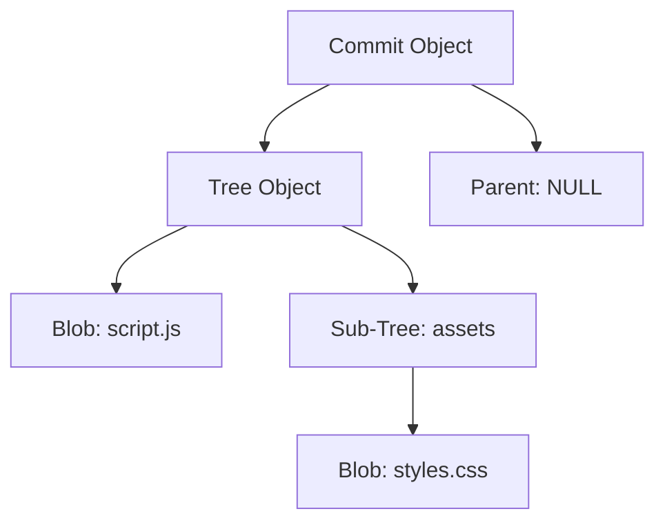

# Módulo 01: Arquitectura Profunda de Git

Git no es solo una herramienta de "guardado", es una **Base de Datos de Objetos direccionable por contenido**. Para un ingeniero de sistemas, entender Git significa entender cómo manipula los datos en el nivel más bajo.

---

## 🔬 Internals: El Corazón de Git (Blobs & Trees)

Git utiliza una estructura de **Grafo Acíclico Dirigido (DAG)** para representar la historia. A diferencia de SVN que guarda "deltas" (diferencias), Git guarda **Snapshots** (instantáneas complejas).

### La Base de Datos de Objetos
Todo en Git se guarda en `.git/objects` y se identifica con un Hash (SHA-1 o SHA-256 en versiones modernas).

1.  **Blobs (Binary Large Objects):** Solo contienen el **contenido** del archivo, no el nombre ni los permisos.
2.  **Trees (Árboles):** Representan el **directorio**. Contienen los nombres de archivos y apuntan a Blobs u otros Trees.
3.  **Commits:** Apuntan a un Tree específico (el estado del repo en ese momento) y contienen metadatos (autor, fecha, mensaje y el commit padre).

### Visualización de la Arquitectura de Objetos


---

## ⚙️ Optimización e Identidad: SHA-256 y Firma GPG

En un entorno de ingeniería profesional, la integridad es innegociable.

### El Hash como Identificador Único
Git genera un ID de 40 caracteres hexadecimales. Si un solo bit del archivo cambia, el Hash cambia completamente. Esto garantiza que nadie pueda alterar el historial sin ser detectado.

### Firma de Identidad (GPG/SSH)
Para evitar la suplantación de identidad (spoofing), los ingenieros firman sus commits.
```bash
# Configurar firma GPG
git config --global user.signingkey <TU_KEY_ID>
git config --global commit.gpgsign true
```

---

## ## Resumen (Ingeniería de Sistemas)

1.  **Snapshots, no Diffs:** Git es ridículamente rápido porque no calcula diferencias al guardar; simplemente guarda el objeto nuevo y reutiliza los existentes (si no cambiaron) mediante punteros.
2.  **Integridad Criptográfica:** El uso de SHA garantiza que el código que ves es exactamente el código que se escribió.
3.  **Descentralización Real:** Cada clon es una base de datos de objetos completa, lo que permite trabajar sin servidor central con la misma potencia de cómputo.

## 💻 Laboratorio Práctico: Paso a Paso

1. **Inicializa un repositorio:**
   ```bash
   mkdir lab-01
   cd lab-01
   git init
   ```
2. **Explora el directorio oculto:**
   ```bash
   ls -la .git
   ```
3. **Crea un archivo y mira cómo Git crea un Blob:**
   ```bash
   echo "hola" > saludo.txt
   git hash-object -w saludo.txt
   ```
   *(Git te devolverá un hash. Acabas de crear un objeto Blob manualmente en la base de datos de Git).*

---

[Examen: Módulo 01 - Arquitectura de Git](https://forms.gle/toiLYERfdE2BQT1V8)
