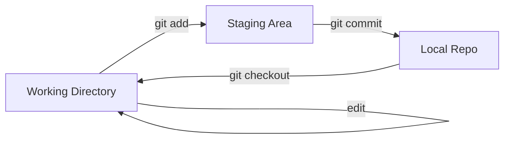

# Módulo 02: El Ciclo de Vida del Código (Staging & Internals)

En la ingeniería de software, el control total del estado de tus archivos es la diferencia entre un commit caótico y una base de código limpia.

---

## 🔬 Los 4 Estados Críticos de Git

Para entender el flujo, debemos visualizar Git como tres zonas de árboles y cuatro estados posibles para un archivo.

### Las Tres Secciones de Git
-   **Working Directory:** Tu área de archivos locales (donde editas).
-   **Staging Area (Index):** El "limbo" donde preparas el próximo snapshot.
-   **Local Repository (.git folder):** Donde viven los objetos y commits confirmados.

### Ciclo de Vida del Archivo
1.  **Untracked:** Archivo nuevo que Git aún no conoce.
2.  **Unmodified:** Archivo que está igual que en el último commit.
3.  **Modified:** Archivo editado pero aún no preparado.
4.  **Staged:** Archivo marcado para incluirse en el próximo commit.

### Visualización del Flujo


---

## ⚙️ Técnicas Pro: .gitignore y Gestión de Archivos

No todo se debe subir. Los secretos, binarios y dependencias (`node_modules`) deben quedar fuera.

### .gitignore de Ingeniería
Un buen `.gitignore` debe ser preventivo.
```text
# Logs y Temporales
*.log
tmp/

# Secretos (¡CRÍTICO!)
.env
*.pem
credentials.json

# Dependencias
node_modules/
dist/
```

### Comandos de Gestión Lógica
-   `git rm --cached <file>`: Elimina el archivo del área de staging pero lo mantiene en tu disco (útil si subiste algo por error).
-   `git mv <old> <new>`: Renombra el archivo y lo marca automáticamente para staging.

---

## ## Resumen (Ingeniería de Sistemas)

1.  **Staging como Filtro:** Nunca hagas `git add .` sin revisar. El área de staging es tu control de calidad para decidir qué entra en la historia.
2.  **Seguridad Proactiva:** El `.gitignore` es tu primera línea de defensa contra la fuga de credenciales.
3.  **Consistencia de Estado:** Git siempre sabe en qué estado está cada byte de tu proyecto. Aprender a leer el `git status` analíticamente es vital.

## 💻 Laboratorio Práctico: Paso a Paso

1. **Crea un archivo secreto y un archivo normal:**
   ```bash
   echo "PASSWORD=12345" > .env
   echo "console.log('hola');" > app.js
   ```
2. **Ignora el archivo secreto:**
   ```bash
   echo ".env" > .gitignore
   ```
3. **Verifica el estado (solo app.js y .gitignore deberían aparecer):**
   ```bash
   git status
   ```
4. **Prepara y confirma (Staging a Repo Local):**
   ```bash
   git add .
   git commit -m "chore: setup de proyecto e ignore"
   ```

---

[Examen: Módulo 02 - Flujo de Trabajo](https://forms.gle/KH5trB9CRZ68MgRRA)