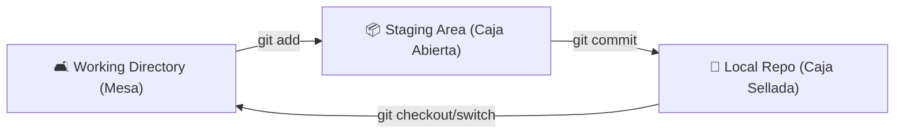

# Módulo 02: El Ciclo de Vida del Código (Staging & Internals)

¡Hola! En esta lección vamos a hablar de cómo viajan tus archivos a través de Git. Muchos principiantes hacen `git add .` y `git commit` por inercia, como un acto de fe. Hoy vas a entender el ciclo de vida de tu código de forma visual e intuitiva.

---

## 🔬 La analogía del mundo real: La Caja de Amazon

Imagínate que estás en tu casa y quieres enviar un paquete a un amigo por **Amazon/Correo**. El flujo de trabajo en Git es idéntico a este proceso:

1.  **Working Directory (Tu Mesa de Trabajo):**
    *   **En la vida real:** Es la mesa de tu sala, donde tienes un montón de cosas desordenadas: juguetes, libros sueltos, envoltorios de dulces, etc.
    *   **En Git:** Son tus archivos locales en tu editor de código. Aquí puedes crear, borrar o editar archivos libremente. Git los observa pero aún no los tiene asegurados. Están en estado **Untracked** (no rastreados) o **Modified** (modificados).

2.  **Staging Area o Index (La Caja Abierta):**
    *   **En la vida real:** Es una caja de cartón abierta sobre la mesa. Decides meter el libro y el juguete en la caja (`git add libro.txt`). El envoltorio de dulce lo dejas fuera en la mesa porque es basura. La caja abierta es tu filtro de calidad.
    *   **En Git:** Es la zona de preparación. Aquí decides qué cambios específicos formarán parte de tu próximo commit. Los archivos aquí están en estado **Staged**.

3.  **Local Repository (La Caja Sellada y Etiquetada):**
    *   **En la vida real:** Cierras la caja con cinta adhesiva, pegas una etiqueta de envío con un número de rastreo único y la dejas lista en el correo (`git commit -m "envio de regalo"`). La caja ya no se puede modificar; es una foto inalterable en el tiempo.
    *   **En Git:** Es la base de datos de commits local en tu disco. Tus cambios se han congelado en un commit seguro. Los archivos vuelven a estar en estado **Unmodified** con respecto al último commit.

### El Flujo de la Caja de Amazon

Visualiza el camino de tus archivos:


```mermaid
graph LR
    Mesa["🛋️ Working Directory (Mesa)"] -->|git add| Caja["📦 Staging Area (Caja Abierta)"]
    Caja -->|git commit| Correo["🚚 Local Repo (Caja Sellada)"]
    Correo -->|git checkout/switch| Mesa
```

---

## ⚙️ Técnicas de Seguridad: El filtro .gitignore

En tu mesa de trabajo (Working Directory) vas a tener cosas que **nunca** deberías meter en la caja de Amazon (Staging Area), como contraseñas, secretos de configuración o basura temporal del sistema. Para esto sirve el archivo `.gitignore`.

*   **¿Qué ignorar obligatoriamente?**
    *   Secretos y contraseñas: archivos `.env` o credenciales de bases de datos.
    *   Carpetas de dependencias: como `node_modules/` o carpetas de build (`dist/`).
    *   Logs y archivos temporales.

### Comando Pro: ¿Subiste algo por error?
Si metiste un archivo confidencial en la caja y ya le pusiste cinta adhesiva (hiciste commit), puedes sacarlo del Staging sin borrarlo de tu computadora usando:
```bash
git rm --cached archivo_secreto.txt
```

---

## 🧠 Pon a prueba tus conocimientos

<div class="module-quiz-card" data-module="Curso/02-Instalacion/README.md"></div>

---

## 📝 Resumen Estructurado (Estilo Cornell)

*   **Staging como Control de Calidad:** No hagas `git add .` a ciegas. Selecciona con cuidado qué archivos están listos para empaquetar.
*   **Seguridad Proactiva:** Configura tu `.gitignore` desde el primer día para evitar desastres y fuga de datos en repositorios públicos.
*   **Consistencia de Estado:** Un archivo siempre transita de forma predecible: Untracked ➔ Staged ➔ Committed.

---

## 💻 Laboratorio Práctico: ¡Pruébalo en la terminal virtual!

Usa la consola interactiva de la WebApp para experimentar el flujo de preparación e ignorado de secretos en orden secuencial:

1. **Crea un archivo de configuración secreto en tu mesa de trabajo:**
   ```bash
   echo "PASSWORD=123" > .env
   ```
   *(Este archivo contiene datos sensibles que nunca deben ser compartidos).*

2. **Crea el archivo principal de código de tu aplicación:**
   ```bash
   echo "console.log('app');" > app.js
   ```
   *(Este archivo sí es parte del código fuente oficial).*

3. **Crea el archivo `.gitignore` y configura la exclusión del archivo secreto:**
   ```bash
   echo ".env" > .gitignore
   ```
   *(Le indicas a Git que ignore por completo el archivo `.env`).*

4. **Revisa el estado de la mesa para verificar que Git no ve el archivo `.env`:**
   ```bash
   git status
   ```
   *(Comprobarás que en la lista de archivos sin seguimiento sólo figuran `app.js` y `.gitignore`, mientras `.env` está perfectamente oculto).*

5. **Coloca todo el código fuente listo dentro de la caja de preparación:**
   ```bash
   git add .
   ```
   *(Git preparará sólo los archivos permitidos).*

6. **Comprueba el estado del Staging Area para ver qué se guardará:**
   ```bash
   git status
   ```
   *(Verás en verde listos para commit `app.js` y `.gitignore`, pero nunca `.env`).*

7. **Sella la caja y haz el commit oficial de configuración:**
   ```bash
   git commit -m "chore: setup de proyecto"
   ```
   *(Se congela esta Polaroid de tu proyecto en el historial).*

8. **Examina el historial de confirmaciones para corroborar el commit:**
   ```bash
   git log
   ```
   *(Verás tu commit listado de forma limpia con su respectivo hash y mensaje).*