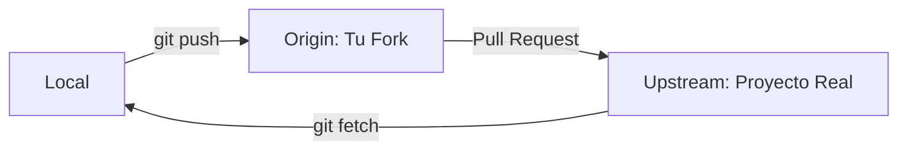

# Módulo 04: Colaboración Distribuida (Networking Git)

En la ingeniería moderna, nadie trabaja solo. Entender cómo sincronizar estados de código entre diferentes máquinas es vital para la entrega continua.

---

## 🔬 El Modelo Pull-Push (Arquitectura Cliente-Servidor)

Aunque Git es distribuido, usamos servidores como GitHub como un **Golden Repo** (punto de verdad).

### Componentes de Sincronización
-   **Fetch vs Pull:** `fetch` descarga los cambios pero no los mezcla (seguro). `pull` es un `fetch` + `merge` (cómodo pero peligroso si no sabes qué descargas).
-   **Remotes (Origin vs Upstream):** `origin` es tu copia personal en la nube. `upstream` es el repositorio original del cual hiciste el Fork.

### Flujo de Sincronización Pro

---

## ⚙️ Técnicas de Colaboración: PRs y Code Review

Un **Pull Request (PR)** no es solo un botón; es una auditoría técnica y de seguridad de tu código.

### Anatomía de un PR de Élite
1.  **Contexto:** ¿Qué problema resuelve este código?
2.  **Impacto:** Áreas del sistema que se verán afectadas.
3.  **Pruebas:** Cómo se ha verificado que funciona.

### Code Review (Revisión de Pares)
Es el momento donde otros ingenieros critican constructivamente el código. En 2027, esto se apoya con sugerencias de IA, pero la decisión final es humana.

---

## ## Resumen (Ingeniería de Sistemas)

1.  **Draft PRs:** Úsalos para pedir feedback temprano sin intención de mezclar todavía el código.
2.  **Higiene de Commits:** Siempre haz un `rebase` o un `merge` con tu base actualizada antes de enviar tu PR para evitar conflictos en el servidor.
3.  **Comunicación Técnica:** Los comentarios en el PR deben ser objetivos. Enfócate en el código, no en el programador.

[Examen: Módulo 05 - Colaboración Remota](https://forms.gle/xxKEAv6z33Qh6sZ98)
