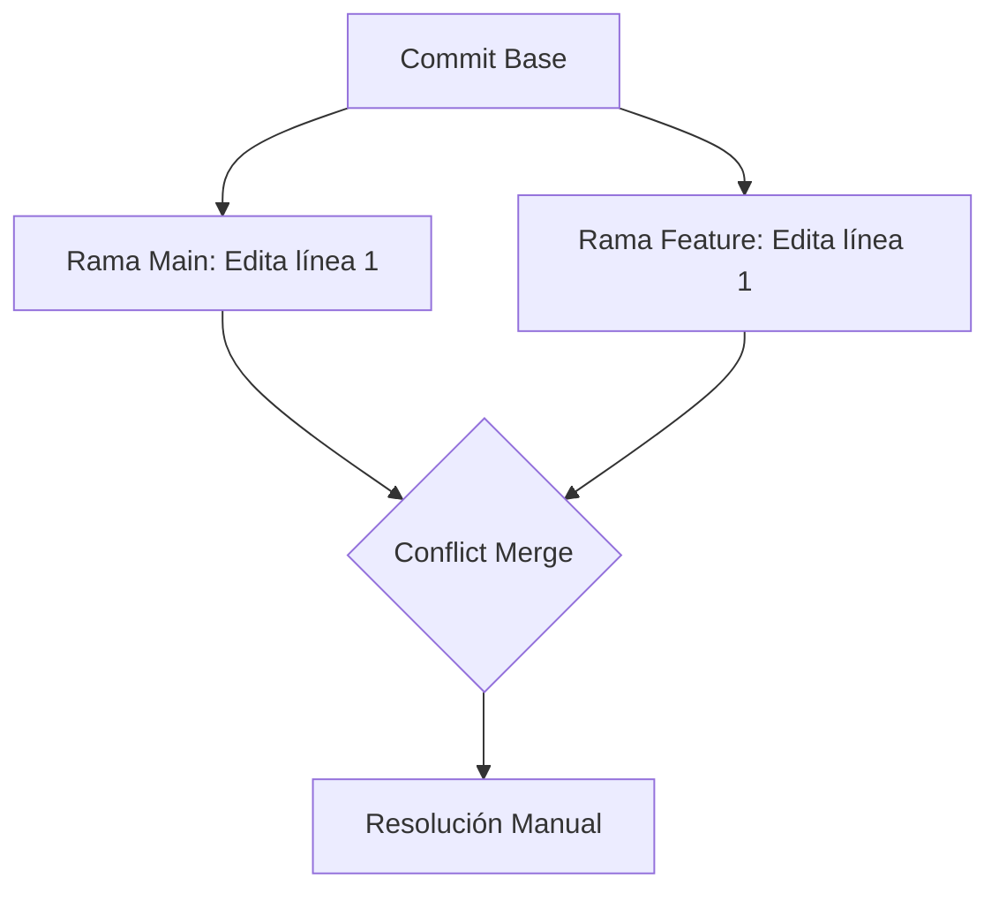

# Módulo 07: Control de Versiones y Gestión de Conflictos

El conflicto no es un error, es una **divergencia de opiniones** que Git no puede resolver solo. Aprender a gestionarlos sin miedo diferencia a un junior de un senior.

---

## ⚡ ¿Por qué ocurren los conflictos?
Un conflicto ocurre cuando:
1.  Dos personas editan la **misma línea** del mismo archivo en ramas diferentes.
2.  Una persona borra un archivo mientras otra lo está editando.




---

## 🔍 Anatomía de un Conflicto
Cuando Git se detiene por un conflicto, verás estos marcadores en tu código:

```text
<<<<<<< HEAD (Current Change)
Código que tú tienes en tu rama actual.
=======
Código que viene de la rama que intentas fusionar.
>>>>>>> branch-name (Incoming Change)
```

**Pasos para resolver:**
1.  **Analizar:** Lee ambas versiones y decide cuál es la correcta (o combina ambas).
2.  **Limpiar:** Borra los marcadores (`<<<<`, `====`, `>>>>`).
3.  **Add:** Marca el archivo como resuelto con `git add <archivo>`.
4.  **Commit:** Finaliza el proceso.

---

## 🛠️ Herramientas de Resolución
-   **VS Code Merge Editor:** Proporciona una interfaz visual "3-way merge" muy potente.
-   **git merge --abort:** Si te pánico, usa esto para volver al estado anterior como si nada hubiera pasado.

---

## 🧪 Estrategias Senior para evitar Conflictos
1.  **Pulls frecuentes:** No trabajes 3 días sin sincronizarte con `main`.
2.  **Ramas pequeñas:** Entre más pequeña la tarea, menos probabilidad de chocar con otros.
3.  **Comunicación:** Si vas a refactorizar un archivo núcleo, avisa a tu equipo.

---

## ## Resumen (Ingeniería de Sistemas)
1.  **Atomicidad:** Mantén tus cambios atómicos. Un commit debe hacer una sola cosa.
2.  **Determinismo:** No dejes que el IDE resuelva conflictos automáticamente si no entiendes qué está haciendo.
3.  **Rebase:** En flujos profesionales, se prefiere `git rebase` para mantener una historia lineal, aunque esto requiere más cuidado con los conflictos.

## 💻 Laboratorio Práctico: Paso a Paso

1. **Fuerza un conflicto:**
   ```bash
   # En rama main
   echo "Texto A" > archivo.txt
   git commit -am "A"
   
   # En nueva rama
   git checkout -b conflicto
   echo "Texto B" > archivo.txt
   git commit -am "B"
   
   # Crea el conflicto
   git checkout main
   git merge conflicto
   ```
2. **Abre tu editor (ej. VS Code) para resolver el conflicto manualmente.**
3. **Termina el merge:**
   ```bash
   git add archivo.txt
   git commit
   ```

---

[Laboratorio: Simulador de Conflictos](https://github.com/ByChokeYT/Curso_de_Git_GitHub)
