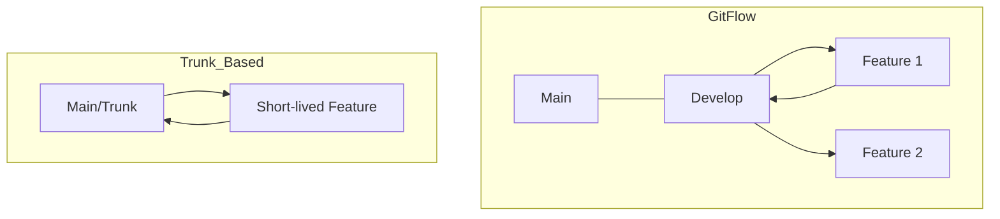

# Módulo 09: Buenas Prácticas (Nivel Senior)

Escribir código es fácil; mantener un historial de cambios limpio y profesional en un equipo de 50 personas es el verdadero reto de ingeniería.

---

## 📝 Commits Semánticos (Conventional Commits)
Un commit no debe decir "arreglé un bug". Debe seguir un estándar:
`type(scope): description`

-   **feat:** Una nueva funcionalidad.
-   **fix:** Corrección de un error.
-   **docs:** Cambios en documentación.
-   **style:** Cambios que no afectan la lógica (espacios, formato).
-   **refactor:** Cambio de código que ni arregla un bug ni añade una función.
-   **test:** Añadir o arreglar tests.

Ejemplo: `feat(auth): implementar login con Google OAuth2`

---

## 🌲 Estrategias de Ramas (Workflows)
1.  **GitFlow:** Ideal para proyectos con ciclos de lanzamiento fijos (Main, Develop, Feature, Hotfix, Release).
2.  **GitHub Flow / Trunk Based:** Ideal para despliegue continuo. Todo sale de `main` y vuelve a `main` rápidamente.




---

## 🛑 .gitignore Profesional
No subas basura a tu repo. Siempre ignora:
-   Dependencias (`node_modules/`, `vendor/`).
-   Variables de entorno (`.env`).
-   Archivos del SO (`.DS_Store`, `Thumbs.db`).
-   Binarios compilados (`/dist`, `/build`).

---

## 📏 Code Review (Etiqueta)
Al revisar el código de un compañero:
-   **Sé constructivo:** "Podríamos mejorar esto" vs "Esto está mal".
-   **Nitpicks:** Diferencia entre errores graves y sugerencias de estilo (usa el prefijo `nit:`).
-   **Aprende:** Leer código de otros es la mejor forma de crecer.

---

## ## Resumen (Ingeniería de Sistemas)
1.  **Historia Lineal:** Intenta usar `rebase` para evitar "Merge Commits" innecesarios que ensucian el grafo.
2.  **Atomicidad:** Cada commit debe ser una unidad mínima funcional.
3.  **Responsabilidad:** El que rompe `main`, lo arregla (o lo revierte inmediatamente).

## 💻 Laboratorio Práctico: Paso a Paso

1. **Practica Conventional Commits:**
   ```bash
   # Hacer un commit de una nueva función
   git commit -m "feat(ui): añadir botón de modo oscuro"
   
   # Hacer un commit de un bugfix
   git commit -m "fix(auth): corregir caída del servidor al usar token expirado"
   ```
2. **Genera un entorno ignorado:**
   ```bash
   mkdir build
   echo "build/" >> .gitignore
   git add .gitignore
   git commit -m "chore: ignorar carpeta build"
   ```

---

[Laboratorio: Genera un Changelog automático](https://www.conventionalcommits.org/en/v1.0.0/)
