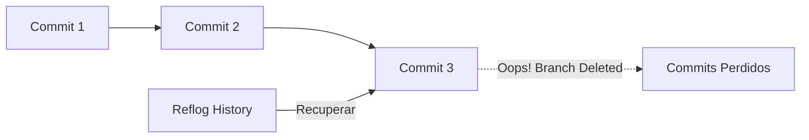

# Módulo 12: Laboratorio de Desastres (The "Oh Sh*t" Module)

Todo desarrollador comete errores. La diferencia es que un experto sabe cómo usar Git para viajar en el tiempo y deshacer el caos.

---

## 🕒 Git Reflog: El Seguro de Vida
¿Borraste una rama por accidente? ¿Hiciste un reset y perdiste un commit valioso?
`git reflog` guarda un historial de **todos los movimientos** del HEAD en tu máquina local durante los últimos 90 días.

**Cómo usarlo:**
1.  Escribe `git reflog`.
2.  Busca el hash del estado justo antes del desastre.
3.  Usa `git reset --hard <HASH>` o `git checkout <HASH>`.




---

## 🔍 Git Bisect: El Detective
Tienes un bug que no estaba hace dos semanas, pero no sabes qué commit lo introdujo. `git bisect` hace una búsqueda binaria automática.

```bash
git bisect start
git bisect bad                 # El commit actual tiene el bug
git bisect good v1.0.0         # Sabemos que en la versión 1.0.0 todo funcionaba
# Git empezará a cambiar de commits y te preguntará:
# ¿Funciona? (git bisect good / git bisect bad)
```
Al final, Git te dirá exactamente qué commit fue el culpable.

---

## 🍒 Git Cherry-pick
Necesitas un commit específico de la rama `feature-x` en tu rama `main`, pero no quieres fusionar toda la rama porque tiene cosas incompletas.

`git cherry-pick <HASH-DEL-COMMIT>`

---

## 🚑 Escenarios Comunes
-   **Me equivoqué en el mensaje del último commit:** `git commit --amend -m "Nuevo mensaje"`.
-   **Subí algo a la rama equivocada:** Usa `git reset HEAD~1 --soft` para deshacer el commit pero mantener los cambios, luego cambia de rama y haz commit.
-   **Hice un desastre masivo y quiero volver a como está en el servidor:** `git reset --hard origin/main`.

---

## ## Resumen (Ingeniería de Sistemas)
1.  **Nada se pierde:** En Git, casi todo es recuperable si se ha hecho un commit al menos una vez.
2.  **Reset vs Revert:** Usa `reset` para limpiar tu local; usa `revert` para deshacer cambios que ya están en el servidor (para no romper la historia de otros).
3.  **Calma:** Ante un error, no borres la carpeta `.git`. Usa las herramientas integradas.

## 💻 Laboratorio Práctico: Paso a Paso

1. **Haz un commit y luego destrúyelo:**
   ```bash
   echo "Secreto" > importante.txt
   git add .
   git commit -m "feat: archivo importante"
   
   # Borra el commit y los cambios simulando un accidente
   git reset --hard HEAD~1
   ```
2. **¡El pánico se apodera de ti! Busca el reflog:**
   ```bash
   git reflog
   ```
3. **Rescata tu commit perdido:**
   ```bash
   # Reemplaza <HASH> con el ID que viste en el paso 2
   git reset --hard <HASH>
   cat importante.txt # ¡El archivo ha vuelto!
   ```

---

[Laboratorio: Practica con Git Flight Rules](https://github.com/k88hudson/git-flight-rules)
